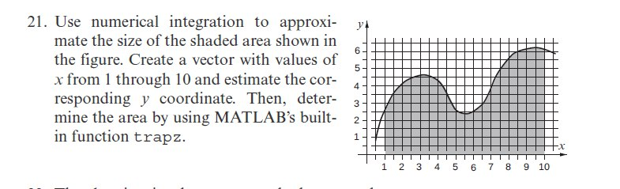
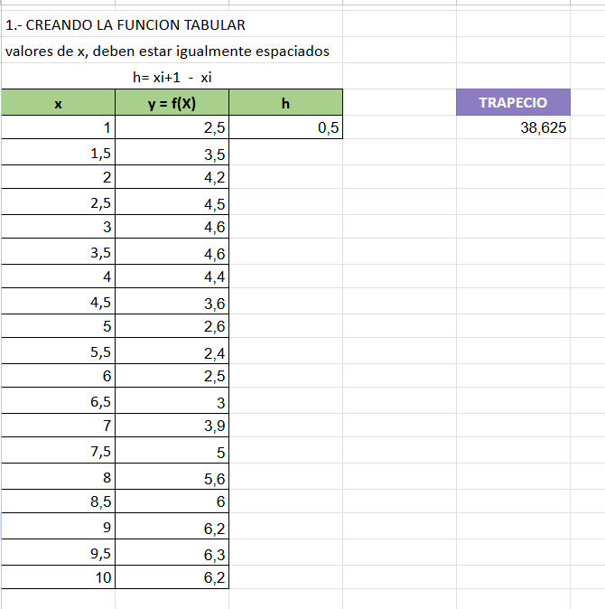
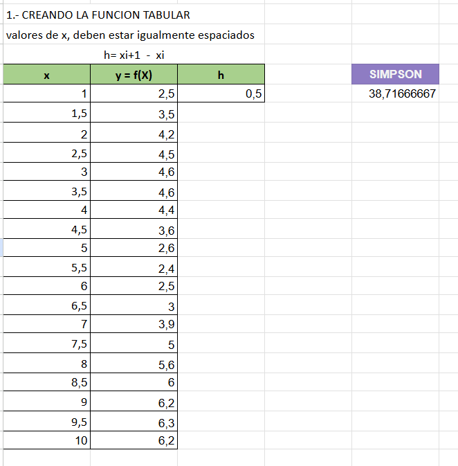
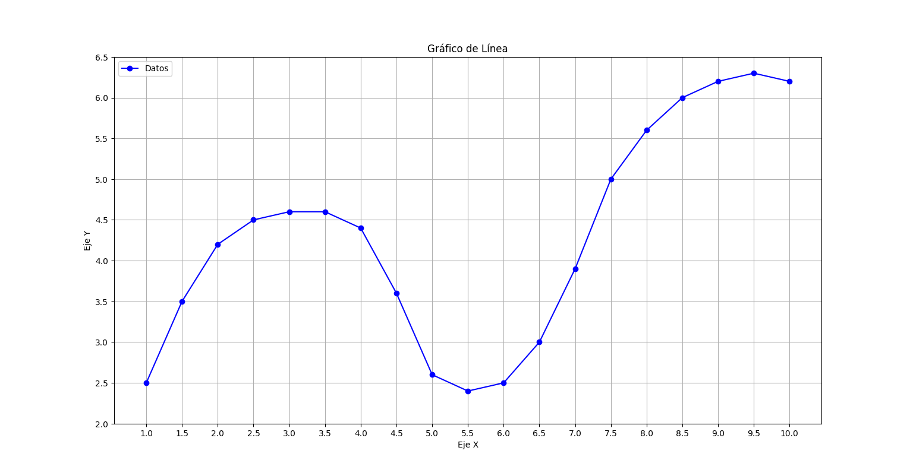

# PROBLEMA


## Metodo del Trapecio
### Excel

### Programa (Python)
El siguiente programa fue desarrollado por la inteligencia artificial **POE**.
```{python}
def trapecio_tabular(x, y):
    """
    Calcula la integral usando el método del trapecio con datos tabulares.
    
    :param x: Lista de puntos x (límites de integración)
    :param y: Lista de valores de la función en esos puntos
    :return: Aproximación de la integral
    """
    n = len(x) - 1  # Número de trapecios
    integral = 0.0

    for i in range(n):
        h = x[i + 1] - x[i]  # Ancho del trapecio
        integral += (h / 2) * (y[i] + y[i + 1])  # Área del trapecio

    return integral

# Ejemplo de uso
# Datos tabulares (x, y)
x = [1.0, 1.5, 2.0, 2.5, 3.0, 3.5, 4.0, 4.5, 5.0, 5.5, 6.0, 6.5, 7.0, 7.5, 8.0, 8.5, 9.0, 9.5, 10.0]  # Puntos x
y = [2.5, 3.5, 4.2, 4.5, 4.6, 4.6, 4.4, 3.6, 2.6, 2.4, 2.5, 3.0, 3.9, 5.0, 5.6, 6.0, 6.2, 6.3, 6.2]  # Valores correspondientes de la función

resultado = trapecio_tabular(x, y)
print(f"La integral aproximada es: {resultado}")
```
Salida en consola:
```{python}
La integral aproximada es: 38.625
```

### Comparando resultados

|Excel|Programa|
|:-:|:-:|
|38,625|38.625|

## Metodo de Simpson



### Programa (Python)
El siguiente programa fue desarrollado por la inteligencia artificial **POE**.
```{python}
def simpson_tabular(x, y):
    """
    Calcula la integral usando el método de Simpson con datos tabulares.

    :param x: Lista de puntos x (límites de integración)
    :param y: Lista de valores de la función en esos puntos
    :return: Aproximación de la integral
    """
    n = len(x) - 1  # Número de intervalos
    if n % 2 != 0:
        raise ValueError("El número de intervalos debe ser par.")

    integral = y[0] + y[n]  # Suma de los extremos

    for i in range(1, n, 2):
        integral += 4 * y[i]  # Coeficiente de 4 para los índices impares

    for i in range(2, n - 1, 2):
        integral += 2 * y[i]  # Coeficiente de 2 para los índices pares

    integral *= (x[1] - x[0]) / 3  # Multiplica por el ancho del intervalo

    return integral

# Ejemplo de uso
# Datos tabulares (x, y)
x = [1.0, 1.5, 2.0, 2.5, 3.0, 3.5, 4.0, 4.5, 5.0, 5.5, 6.0, 6.5, 7.0, 7.5, 8.0, 8.5, 9.0, 9.5, 10.0]  # Puntos x
y = [2.5, 3.5, 4.2, 4.5, 4.6, 4.6, 4.4, 3.6, 2.6, 2.4, 2.5, 3.0, 3.9, 5.0, 5.6, 6.0, 6.2, 6.3, 6.2]  # Valores correspondientes de la función

resultado = simpson_tabular(x, y)
print(f"La integral aproximada es: {resultado}")
```
Salida en consola:
```{python}
La integral aproximada es: 38.71666666666666
```

### Comparando resultados

|Excel|Programa|
|:-:|:-:|
|38,71666667|38.71666666666666|

## Gráfica


## Conclusiones
El área bajo la curva haciendo uso el método del **Trapecio** es: **38.625**

El área bajo la curva haciendo uso el método de **Simpson** es: **38.71666667**